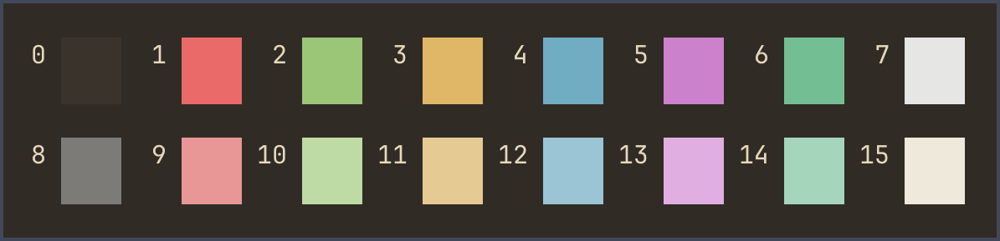

# Nevergrove Ghostty
The Nevergrove color scheme for Ghostty. All variants.

 

* [Ghostty for macOS and Linux](https://ghostty.org/)

* [Nevergrove color palette](https://icarojam.github.io/nevergrove/) 

Place files in ~/.config/ghostty/themes/ (create folders if non-existing).

*Nevergrove Aspen*

